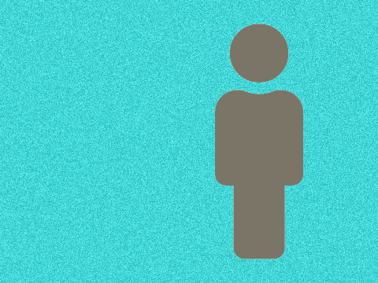

# icon-image

Python script to quickly generate a [Font Awesome](https://fontawesome.com/) icon imposed on a background, mostly intended to be used to steer the usage of a VQGAN + CLIP model generation, such as with this [Colab Notebook](https://colab.research.google.com/drive/1Foi0mCSE6NrW9oI3Fhni7158Krz4ZXdH?usp=sharing).

Inspired by Mark Ridel's [attempt at controlling figure placement](https://twitter.com/mark_riedl/status/1421282588791132161) for VQGAN + CLIP.

## Installation

You can the dependences via:

```sh
pip3 install Pillow numpy fire icon_font_to_png
```

## Usage

Download this repo from GitHub and `cd` into the downloaded folder.

The main usage is a `icon_image.py` script, which can be used to generate an icon image.

For example, with the default usage:

```sh
python3 icon_image.py
```

Generates this image:


If you want to generate an icon in the shape of the Facebook logo with appropriate colors and no background noise, you could do:

```sh
python3 icon_image.py --icon_name "fab fa-facebook-f" --bg_color white --icon_color "#4267B2" --bg_noise False
```


If you want to create a rectangular image with an icon aligned right, you can do:

```sh
python3 icon_image.py --icon_name "fas fa-male" --bg_color "#34ebeb" --bg_width 480 --bg_height 360 --icon_size 300 --align_right
```



### CLI Arguments

- icon_name: The Font Awesome icon name, including the `fa-` prefix. (e.g. `fab fa-apple`)
- bg_color: Background color, in text or hex.
- icon_color: Icon color, in text or hex.
- bg_noise: Whether to add uniform noise to the background. (default: `True`)
- bg_noise_opacity: The strength of the noise, in range [0, 1]. (default: `0.2`)
- bg_width: Width of the final image (default: `600`)
- bg_height: Height of the final image (default: `600`)
- icon_size: Size of the icon within the final image, which should be slightly smaller than the background. (default: `500`)
- seed: Seed for random noise generation. (default: `42`)
- align_left: Align the icon to the left. (default: `False`)
- align_right: Align the icon to the right. (default: `False`)
- align_top: Align the icon to the top. (default: `False`)
- align_bottom: Align the icon to the bottom. (default: `False`)

## Helpful Notes

- The default parameters of 600px for the image and 500px for the icon are chosen to be the largest compatible with the default parameters of the VQGAN + CLIP Colab Notebook without going OOM.
- When using it as a initial/target in the VQGAN + CLIP Colab Notebook, it's help to set background and icon colors to be similar to what you want in the final result.
- The use of the background noise _theoetically_ helps VQGAN + CLIP differentiate between the icon and the background, but experimentation will always be useful.
- The default icon color, `#7b7568`, roughly corresponds to the RGB color of the mean ImageNet image, which the VQGAN + CLIP Colab Notebook normalizes.

## Maintainer/Creator

Max Woolf ([@minimaxir](https://minimaxir.com))

_Max's open-source projects are supported by his [Patreon](https://www.patreon.com/minimaxir) and [GitHub Sponsors](https://github.com/sponsors/minimaxir). If you found this project helpful, any monetary contributions to the Patreon are appreciated and will be put to good creative use._

## License

MIT

Font Awesome icon font files included per the terms in its [SIL OFL 1.1 License](https://scripts.sil.org/cms/scripts/page.php?site_id=nrsi&id=OFL).
